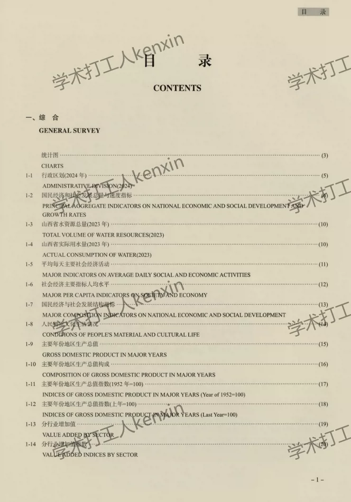
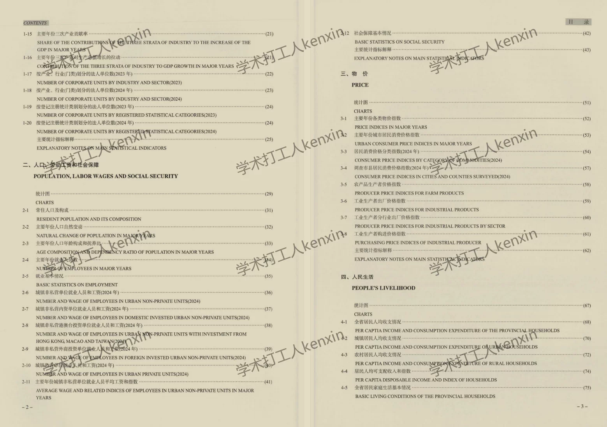
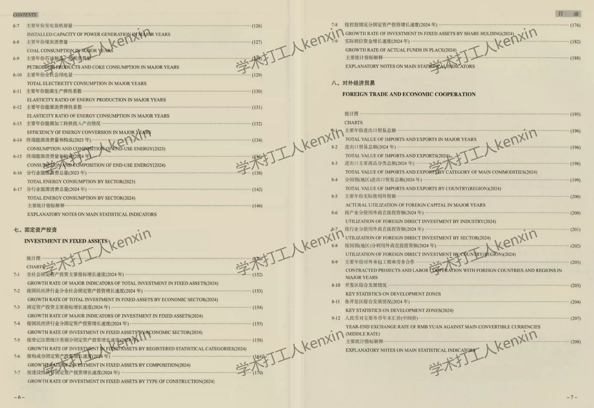
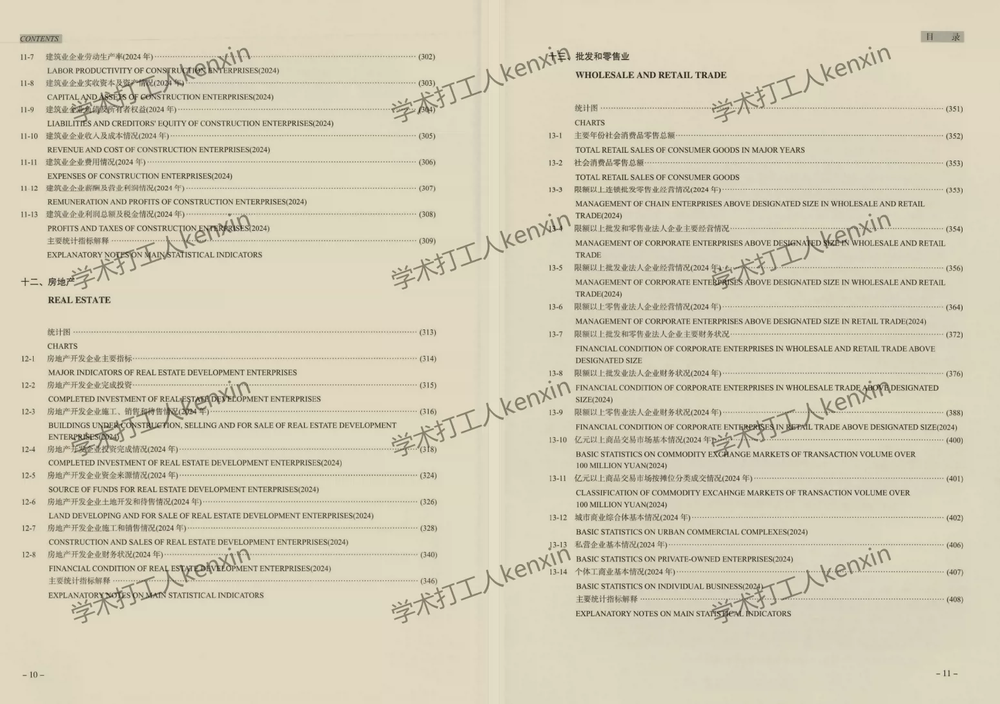
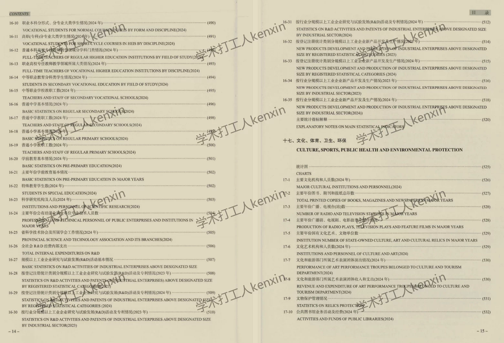

## Body

《Shanxi Statistical Yearbook》（1983-2025）

Data Year: The yearbook covers the years from 1983 to 2025. (The data year should be one less than the actual yearbook year).
All are original yearbooks, not pre-compiled panel data! Please read carefully before purchasing and understand that after purchase, there will be no returns or exchanges.

01. Data Introduction
"Shanxi Statistical Yearbook"

02. Indicator Details
The directory is displayed in the picture for reference. Due to the limited space of the picture, it cannot display all indicators. The actual content of the yearbook should be referred to. Please view it on your own and make a purchase accordingly. If you need help finding data, I can assist you here. However, after shipment, we do not support return without reason.
The display directory is for 2025, for reference only. Different statistical口径 may change over different years. For academic knowledge, please note.

## Images

item_1071656780303

Here is a pay link on Stripe ( https://buy.stripe.com/3cs8yP7sY87d0vu9AB ). Please contact me lonlonago@foxmail.com after funding $89, and I will send you a complete data files , thank you!

